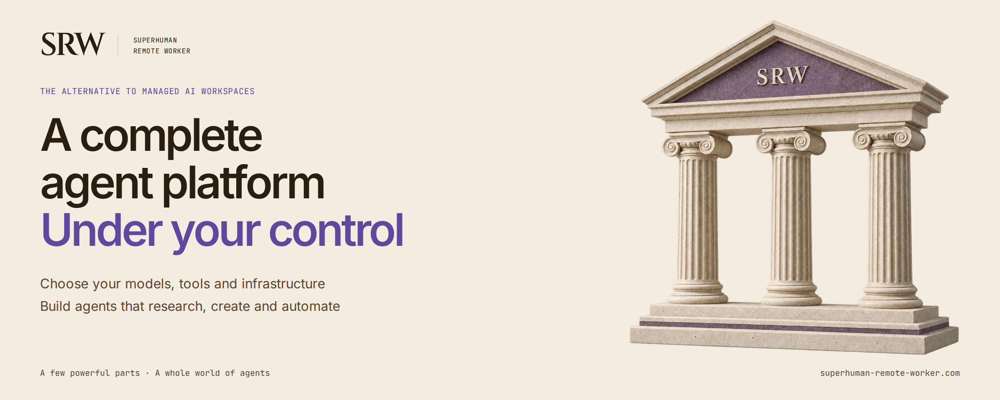

# Superhuman Remote Worker

**A complete agent platform — Under your control**

[](https://github.com/superhuman-remote-worker/srw/actions/workflows/main.yml)
[](https://github.com/superhuman-remote-worker/srw/tags)
[](LICENSE)

[Website](https://superhuman-remote-worker.com/) ·
[Documentation](docs/README.md) ·
[Helm install](helm/README.md)

[](https://superhuman-remote-worker.com/)

Superhuman Remote Worker (SRW) is a self-hosted agent platform for interactive
assistance and autonomous work. Choose your models, tools and infrastructure,
then combine three reusable building blocks to create agents that research,
create and automate:

- an **expert** — the harness image and its private settings. The included SRW
  harness supplies configurable prompts, models and tools;
- a **workspace** — where the work happens: none, files in your object store, a
  throwaway pod, or a VM with its own kernel;
- a **connector** — what it can reach: a repository, a database, a cloud folder,
  a mailbox, an MCP server. A knowledge base is a connector too.

A job brings an expert, a workspace and connectors together. The SRW
orchestrator deploys and manages the work, coordinates execution, and returns
progress, results and an audit trail. The included agent harness works with
the orchestrator to support both interactive sessions and background jobs.

The [`srw/v1alpha1` resource manifests](examples/manifests/README.md) define
Experts, WorkspaceTemplates, Connectors, Projects and Jobs in JSON or YAML.
The same resource API serves `srw` CLI commands and MCP operations. See the
examples for reference and inline configuration, versioned apply, workspace
retention, migration behavior and current hosting requirements.

The model is replaceable. The execution, memory, permissions, observability,
and recovery layers around it are the product.

> [!IMPORTANT]
> SRW is under active development and can execute model-generated code. Start
> with disposable data and supervised or review-gated workflows. Read the
> [security model](docs/security-model.md) before connecting valuable systems or
> enabling unattended work.

## The mental model

SRW organizes work around three concepts, each a combination of the building
blocks above: a session is an expert you talk to, a job is an expert working
unattended in a workspace, and a project is a saved recipe of experts,
workspace tier and connectors.


| Concept | Use it for | What persists |
|---|---|---|
| **Session** | Interactive work you want to watch and steer in real time | Conversation, files, citations, and agent state |
| **Job** | A durable goal an agent can plan and execute in the background | Status, checkpoints, artifacts, review history, and logs |
| **Project** | Ongoing work shared by sessions, jobs, and people | Goal, members, knowledge, memory, connectors, repositories, and loops |

**Experts** are configurable agent roles. **Skills** provide reusable
procedures. **Connectors** grant scoped access to repositories, databases,
cloud files, email, MCP servers, and other external systems.

## Why SRW

- **Interactive and autonomous work in one system.** The same agent runtime
  powers low-latency sessions and checkpointed background jobs.
- **Execution outside the harness.** Shell-capable work happens in a separate
  per-job or per-session container or VM, reached through a narrow remote
  workspace interface.
- **Durable work, not disposable prompts.** Checkpoints, files, git history,
  project knowledge, and optional recalled memory let work continue across
  process restarts and context windows.
- **Control over autonomy.** Permission modes, completion review, privileged
  action gates, workspace upgrades, budgets, and an inbox keep people in the
  control path where it matters.
- **Model and tool flexibility.** The model catalog supports hosted providers
  and OpenAI-compatible endpoints; experts and tool groups are configured
  independently of the core runtime.
- **A real control plane.** The orchestrator owns dispatch and final job state,
  while Kubernetes supplies per-workload scheduling, isolation, and scaling.

Depending on the selected expert, workspace, connectors, and deployment
configuration, agents can research the web, interact with websites, process
documents, work in git repositories, query databases, create file deliverables,
manage citations, and delegate work to other agents.

## Quick start

SRW deploys through Helm to Kubernetes. The supported local evaluation path
runs the same chart on a single-node [k3d](https://k3d.io) cluster.

You need a Linux host with at least **8 vCPU and 16 GiB RAM**, plus Docker,
`kubectl`, Helm 3.12+, k3d, OpenSSL, and an SSH client. The default multi-host
local profile also needs `mkcert`; the single-origin profile does not. You need
an API key for at least one configured LLM provider. See the
[complete local prerequisites](docs/local-kubernetes.md#prerequisites) before
starting.

```bash
git clone https://github.com/superhuman-remote-worker/srw.git
cd srw

# Add at least one OPENAI_API_KEY, ANTHROPIC_API_KEY, or GROQ_API_KEY.
# Optionally declare providers, models and default pins under `llm.seed`
# so a rebuilt cluster needs no Admin → Models setup.
cp deployment/values-local.yaml.example deployment/values-local.yaml
$EDITOR deployment/values-local.yaml

# Create the cluster, local TLS/DNS, required Secrets, and chart dependencies.
./scripts/local-dev-up.sh

# Install the application. The second values file is written by the bootstrap
# and pins every component image to this checkout (the chart's default
# `latest` tags are built from `main` and can be older than a `develop` chart).
helm install srw ./helm \
  --namespace srw \
  --kube-context k3d-srw \
  --values deployment/values-local.yaml \
  --values deployment/values-local-images.yaml
```

To use one self-signed HTTPS address without `mkcert`, cert-manager, or local
DNS setup, select the single-origin profile when creating the cluster and add
its overlay to Helm:

```bash
SRW_EXPOSURE_MODE=single-origin ./scripts/local-dev-up.sh
helm install srw ./helm \
  --namespace srw \
  --kube-context k3d-srw \
  --values deployment/values-local.yaml \
  --values deployment/values-local-single-origin.yaml \
  --values deployment/values-local-images.yaml
```

Open <https://localhost:8443/> and accept the certificate warning for that
origin. An existing k3d cluster created with the 80/443 mapping must be
recreated to obtain the dedicated `127.0.0.1:8443:30443@server:0` mapping.

Wait for the workloads, then open the Cockpit:

```bash
kubectl --context k3d-srw --namespace srw get pods --watch
```

| URL | Username | Password |
|---|---|---|
| <https://localhost/> | `test` | `srw-k3d-dev-test` |

The local values file contains published development credentials and must never
be used on a reachable deployment. This source-based path installs the component
images built from your checkout's history, not a release. Continue with the
[local installation and smoke-test guide](docs/local-kubernetes.md). For an
existing cluster, production topology, HA databases, upgrades, and the OCI
chart, use the [Helm chart guide](helm/README.md).

## Workspaces

Workspace choice is a capability and security decision, not just a storage
setting:

| Workspace | Best for | Boundary and limitations |
|---|---|---|
| **Virtual** | Fast, durable file work | Cloud-backed files without a workspace process; no shell, git, or interactive browser |
| **Container** | General coding, browser, and shell work | Separate pod and filesystem, but shares the node kernel; FUSE-enabled deployments may run the workspace privileged |
| **VM** | Work requiring a stronger boundary or gated root access | Separate guest kernel through QEMU/KubeVirt; higher startup and resource cost |
| **None** | Conversation and tools that need no files | No workspace files, shell, browser, or git |

Managed Sessions default to Virtual; workers default to Container (`sandbox`).
Explicit workspace selections and Project/account defaults take precedence over
these role defaults; see [workspace configuration](config/README.md).
Available upgrades and tools depend on deployment configuration and the user's grants.

## Architecture

```text
                                      model providers
                                            ▲
                                            │
 Browser / Cockpit UI                       │
    │ HTTPS / WebSocket                     │
    ▼                                       │
┌──────────────── TRUSTED CONTROL PLANE ────┴──────────────────────┐
│  Cockpit BFF  ─────►  Orchestrator  ──►  Agent harness pods      │
│                           │                    │                 │
│                           ▼                    │                 │
│              PostgreSQL · pgvector · audit     │                 │
└────────────────────────────────────────────────┼─────────────────┘
                                                 │ job-scoped
                                                 │ workspace channel
┌────────────── UNTRUSTED EXECUTION / CONTENT ───▼─────────────────┐
│  Virtual files       Workspace container       Dedicated VM      │
│  (no process)        (shared node kernel)      (guest kernel)    │
└──────────────────────────────────────────────────────────────────┘
```

The **Orchestrator** owns APIs, authentication, persistence, provisioning,
dispatch, and final job status. The **agent harness** runs the model/tool loop
but does not use its own filesystem as a shell-capable job workspace. The
**Cockpit UI and BFF** expose sessions, jobs, projects, reviews, settings, and
operational state. PostgreSQL services and pgvector hold application state,
checkpoints, memory, and audit data; optional services add git, cloud storage,
graph data, search, and other integrations.

Read the [architecture guide](docs/architecture.md) for lifecycle and component
details.

## Bounded project loops

Projects can run an experimental loop that repeatedly launches worker jobs
toward a project goal. A typical software cycle uses a Scholar to explore, a
Critic to review, and a Developer to implement; other role sequences support
research and writing.

This is workflow-level improvement: agents propose, test, revise, and preserve
knowledge in project artifacts. It does **not** train the underlying model or
guarantee that each iteration is better. Standard and campaign loops require an
iteration budget or deadline, and unattended runs should be inspected rather
than assumed successful. See [bounded project loops](docs/project-loops.md).

## Security model

SRW assumes repositories, generated files, tool output, and executed commands
may be hostile. A working directory is not a security boundary when generated
code and the process enforcing policy share the same filesystem and security
identity. SRW therefore keeps its orchestrator, policy, harness, and control
credentials outside shell-capable workspaces and fails closed when the required
remote workspace cannot be established.

That separation limits blast radius; it does not make arbitrary code safe.
Containers share a kernel, Kubernetes NetworkPolicy depends on the cluster's
CNI, and privileged FUSE workspaces weaken the container boundary further. Use
dedicated VMs for stronger isolation, minimize credentials and network reach,
keep workspaces disposable, and retain human gates for privileged or
irreversible actions.

Read the full [trust and isolation model](docs/security-model.md). Report
vulnerabilities privately according to [SECURITY.md](SECURITY.md).

## Documentation

| Goal | Start here |
|---|---|
| Evaluate SRW on one Linux machine | [Local Kubernetes with k3d](docs/local-kubernetes.md) |
| Install or operate the Helm chart | [Helm chart guide](helm/README.md) |
| Understand components and lifecycles | [Architecture](docs/architecture.md) |
| Understand isolation and trust boundaries | [Security model](docs/security-model.md) |
| Develop and test the repository | [Development guide](docs/development.md) |
| Configure experts | [Expert configuration](config/README.md) |
| Try the v1alpha1 resource configuration contract | [Manifest examples and preview](examples/manifests/README.md) |
| Connect to a session workspace over SSH | [SSH access](ssh-access.md) |
| Browse all public documentation | [Documentation index](docs/README.md) |

## Contributing

Python applications live under `src/agent/`, `src/orchestrator/`,
`src/mcp_server/`, and `src/vm_controller/`, with common support in
`src/shared/`. Install the component's requirements, then run
`python -m pip install --no-deps -e .` from the repository root. Launch the
agent with `python -m agent` and the backend with
`uvicorn orchestrator.main:app --port 8085`. See the
[development guide](docs/development.md) for dependency sets and local setup.

Bug reports, focused fixes, documentation improvements, and design discussions
are welcome. Start with [CONTRIBUTING.md](CONTRIBUTING.md), and use the
[issue tracker](https://github.com/superhuman-remote-worker/srw/issues)
for reproducible bugs and proposals. Do not open public issues for security
reports.

## License

SRW is **source-available** under the
[Functional Source License 1.1, ALv2 Future License](LICENSE). Current versions
may be used, modified, and redistributed for permitted purposes, but may not be
used to offer a competing product or service. Each released version converts to
the Apache License 2.0 two years after that version is made available.

This is not an OSI-approved open-source license during the FSL term. Third-party
software shipped in SRW images is documented in
[THIRD_PARTY_LICENSES.md](THIRD_PARTY_LICENSES.md).
