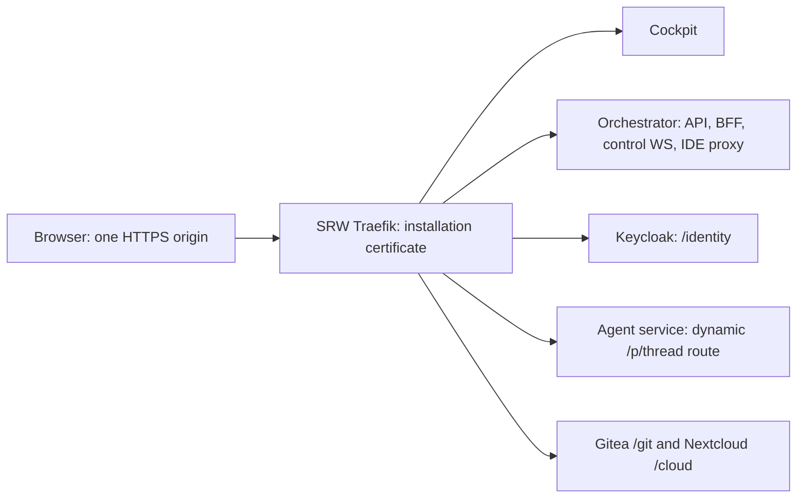

# Single-origin HTTPS with a self-signed certificate

**Status:** Implemented for SRW and the values generator, with source integration
targeting `develop` in both repositories. The design below records the approved scope and
research; the [implementation evidence](2026-09-19-single-origin-https-validation.md)
records actual checks and remaining deployment boundaries. Validation did not
update a release or existing installation. Implementation date: 2026-09-19.

## Problem and intended outcome

University teams and other small organisations frequently deploy evaluation
software at `server_ip:port`, often behind a VPN. Obtaining an official
certificate and registering a domain can take months. Installing a local CA on
every participant's device adds comparable friction to a temporary deployment.

SRW should support opening one HTTPS address, accepting its self-signed
certificate warning, and using the application. Login, API calls, and session
WebSockets must not require visiting a second address to approve another
certificate. The same deployment profile should work at `https://localhost:PORT`
and `https://SERVER-IP:PORT`.

**Selected approach:** an opt-in, chart-owned Traefik gateway with a unique
365-day certificate, one public HTTPS listener, and path routing to the existing
services. Keep the current direct-to-agent session transport. Configure bundled
Keycloak, Gitea, and Nextcloud for the shared origin; disable service-worker
registration in this preset because Chrome still rejects it after click-through.

## Agreed priorities and support boundary

- Browser traffic remains HTTPS/WSS. This feature introduces no public HTTP mode.
- No public DNS, purchased domain, cert-manager, `mkcert`, or client trust-store
  installation is required for the supported browser flow.
- Generate a unique self-signed certificate, valid for **365 days by default**.
  Regeneration on Helm upgrade and a renewed browser warning are acceptable.
  Certificate preservation must not delay delivery.
- Promise one address to approve for the application flow. Browser exception
  retention, private profiles, and managed-browser policies remain browser-owned.
- Keep existing authentication, CSRF checks, token verification, and workspace
  isolation. No new PKI service, security framework, or approval workflow.
- Existing multi-host/trusted-certificate deployments remain the default.

The first preset targets Cockpit, BFF/Keycloak login, control and agent
WebSockets, streaming, jobs, file operations, top-level browser IDE editing and
terminal use, Gitea's web interface, and Nextcloud's web interface. Managed
Git/WebDAV/API operations continue through cluster-local endpoints. Embedded IDE
webviews and extension panes are excluded: existing anti-framing rules reject
them on Cockpit's authority, independently of the service-worker limitation.

The no-extra-trust promise does **not** cover standalone Git, WebDAV/desktop
sync, MCP, SSH/JetBrains clients, or remote SaaS connectors. A browser exception
cannot configure their TLS trust. The preset must suppress unsupported external
connection instructions and capabilities; internal services may remain enabled
where SRW needs them. Native Gitea SSH, Gitea's container registry, optional admin
interfaces, external cloud backends, and generated web-app previews are outside
this first preset. Generated applications retain their separate-origin isolation.

## Evidence from browsers and comparable systems

A scratch HTTPS server exposed a page, fetch endpoint, Secure cookie round-trip,
WSS echo endpoint, and service-worker script. Playwright 1.59.0 used fresh
persistent profiles with `ignoreHTTPSErrors: false`, no certificate-bypass flags,
and clicks on the actual warning controls. The certificate had matching IP and
`localhost` SANs. Both a non-loopback IP and `localhost` were tested on port 18443.

| Check after accepting the warning | Google Chrome 153.0.8010.36 | Playwright Firefox 148.0.2 |
|---|---|---|
| Same-origin fetch, Secure cookie, WSS echo, reload | Passed | Passed |
| `isSecureContext`, `crypto.randomUUID`, media/geolocation API exposure | Available | Available |
| Service-worker registration | Failed: certificate error fetching script | Passed |

These initial fixture results established browser transport behavior. The
separate implementation evidence records SRW's login, uploads, and bundled
integration checks. Media API exposure does not prove a device permission grant. Safari/iOS and managed browsers which prohibit exceptions are
not included in the first-release promise. Certificate replacement or browser
policy may cause another warning at the same address.

Render `window.env.serviceWorkerEnabled=false` for this preset and consume it in
Angular's `provideServiceWorker` configuration. Its default remains true for
existing deployments; preserve the development guard with
`enabled: !isDevMode() && environment.serviceWorkerEnabled`. Parse it as a boolean:
the existing string environment
helper's `value || fallback` would discard explicit `false`. Ordinary browser use
must work without an attempted `ngsw-worker.js` registration, offline caching,
or PWA update/install guarantees. Keep Web Crypto and ordinary media capability
checks enabled. This limitation agrees with the
[Chromium service-worker FAQ](https://www.chromium.org/blink/serviceworker/service-worker-faq/)
and [code-server's webview troubleshooting](https://coder.com/docs/code-server/FAQ).

Other systems establish useful precedents:

| System | Relevant implementation pattern | Application to SRW |
|---|---|---|
| [Portainer](https://docs.portainer.io/start/install-ce/server/docker/linux) | Generates a self-signed certificate and exposes its UI on HTTPS 9443. | Generate installation-specific TLS and share one user-facing address. |
| [Cockpit](https://docs.cockpit-project.org/cockpit-guide/main/guide/https.html) and its [socket handler](https://github.com/cockpit-project/cockpit/blob/main/src/ws/cockpithandlers.c) | Automatic self-signed TLS; browser sockets live at `/cockpit/socket`. | UI and WSS can use the same accepted certificate. |
| [Proxmox VE](https://pve.proxmox.com/pve-docs/pve-admin-guide.pdf) | `pveproxy` serves GUI/API at an IP on port 8006 with a cluster-issued certificate. | An IP-and-port management interface with a warning is an established operator workflow. |
| [code-server](https://coder.com/docs/code-server/guide) | Supports self-signed HTTPS and subpath proxying, with browser feature limitations. | Document the service-worker boundary and test actual browser behavior. |

## Operator experience and Helm contract

The values generator offers **Self-signed HTTPS through proxy**, with a server
IP or `localhost` and a public port. It emits the coordinated chart configuration
and install command. Normal credentials, storage, and workspace prerequisites
still apply; removing certificate setup does not replace Kubernetes.

The proposed values below are **new API, not supported by today's chart**.
Separate address and port fields avoid parsing arbitrary URLs inside Helm:

```yaml
exposure:
  mode: single-origin             # new field; default remains multi-host
  singleOrigin:
    address: "192.0.2.10"          # replace with the server's reachable IPv4
    publicPort: 30443
    service:
      nodePort: 30443
    tls:
      mode: self-signed
      validityDays: 365
```

Derive one canonical origin `O = https://<address>:<publicPort>` and use it for
all public URLs. For local k3d, emit `address: localhost`, `publicPort: 8443`, and
map host port 8443 to node port 30443. The gateway Service uses port 443 and
container target port 8443. Its image is a chart-pinned supported Traefik 3.x
release, **at least 3.1** for the provider/RBAC contract below, with ordinary
repository/tag/digest overrides; never `latest`.

| Installation | Advertised origin | Port mapping |
|---|---|---|
| Existing server/cluster | `https://SERVER-IP:30443` | NodePort 30443 → Service 443 → gateway 8443 |
| Local k3d | `https://localhost:8443` | Host 8443 → node 30443 → gateway 8443 |
| Operator-managed NAT/LB | Explicit configured origin | Operator supplies the matching external port mapping |

An arbitrary public port does not create a matching NodePort: Kubernetes defaults
to 30000–32767. The local launcher should use the k3d equivalent of
`-p "127.0.0.1:8443:30443@server:0"`, rather than sending 443 to the shared K3s
Traefik load balancer. Check the selected port is available. A server needs that
TCP port reachable from its users. See
[Kubernetes NodePort](https://kubernetes.io/docs/concepts/services-networking/service/#type-nodeport)
and [k3d port mappings](https://k3d.io/stable/usage/exposing_services/).

Validate `localhost` or a valid IPv4 address, public port 1–65535, the supported
NodePort range, and positive certificate validity. IPv6 requires explicit
bracket/SAN tests and can follow later. Routing mode and certificate source stay
separate concepts so a supplied certificate can be added without redesigning
public paths. No certificate-source migration is required for the first release.

The mode derives effective same-origin BFF routing, host-only cookies, service
URLs, TLS behavior, and session configuration. It must work without the operator
finding additional flags. Do not set `global.domain` to an IP and reuse today's
subdomain helpers: that would produce names such as `api.192.0.2.10`.

## Gateway and route ownership

Use a small gateway rendered directly by the SRW chart: Deployment, NodePort
Service, ConfigMap, TLS Secret, ServiceAccount, Role, RoleBinding, and ordinary
Ingress resources. No Traefik subchart, CRDs, or new certificate controller.

A dedicated instance is intentional. TLS certificate selection precedes HTTP
routing, and IP literals are excluded from SNI's `HostName` by
[RFC 6066](https://www.rfc-editor.org/rfc/rfc6066.html). Traefik falls back to its
default certificate without SNI, and its default store is shared across that
controller's routes. A per-Ingress Secret cannot alone guarantee the IP client
gets SRW's certificate. Setting a shared controller's default would affect other
applications. Configure the dedicated instance's default through the file
provider and leave strict SNI disabled. See
[Traefik certificate selection](https://doc.traefik.io/traefik/reference/routing-configuration/http/tls/tls-certificates/).

The controller contract is:

- One public entrypoint, `websecure`, at `:8443`, with entrypoint-wide TLS.
- Kubernetes Ingress provider scoped to the release namespace and an exact,
  chart-derived class annotation. One helper computes a stable release-specific
  value from namespace/release, preserving a short hash and suffix within the
  length limit. Feed it to the controller's `ingressclass` option, static route
  annotations, and orchestrator configuration for dynamic routes/reconciliation.
  It requires no operator/generator setting.
- `disableClusterScopeResources=true`; omit `spec.ingressClassName` and use
  `kubernetes.io/ingress.class` on every owned Ingress. This intentionally uses
  Traefik's supported annotation selector to avoid cluster-scoped resources.
- Omit `rules[].host`: IPs and ports do not belong in that field. Omit per-route
  TLS blocks; the dedicated entrypoint/default certificate handles TLS.
- Namespaced read permissions for Services, Secrets, EndpointSlices, and
  Ingresses. Omit ingress-status publication and all `ingressEndpoint` settings;
  no Node, IngressClass, or status-write permissions are needed.
- Do not expose the dashboard or health listener through the public Service.
  Reject nonempty `agent.pinnedLegacyNamespaces` in this mode until deliberate
  multi-namespace watching/RBAC support exists.

Traefik documents the namespace/class filtering and annotation behavior in its
[Ingress provider configuration](https://doc.traefik.io/traefik/reference/install-configuration/providers/kubernetes/kubernetes-ingress/).
Kubernetes' [default-class admission code](https://github.com/kubernetes/kubernetes/blob/master/plugin/pkg/admission/network/defaultingressclass/admission.go)
leaves an Ingress with the annotation unchanged. Integration tests must still
prove the installed shared controller ignores these routes. Verify status-write
behavior against the pinned Traefik release; the
[v3.1 implementation](https://github.com/traefik/traefik/blob/v3.1/pkg/provider/kubernetes/ingress/kubernetes.go)
returns immediately when no ingress endpoint is configured.



### Public routes and rewriting

| Public match | Backend | Prefix handling |
|---|---|---|
| `/api`, `/auth`, `/ws` | Orchestrator | Preserve; browser IDE already lives under `/api/ide/...`. |
| `/identity` | Keycloak | Preserve; configure Keycloak's native context path. |
| `/p/<thread>` | That session's agent Service | Existing dynamic route, preserve path and token. |
| `/git/` | Gitea | Strip `/git`; upstream public base is `O/git/`. |
| `/cloud/` | Nextcloud | Strip `/cloud`; upstream public webroot is `/cloud`. |
| `/` | Cockpit | Fallback for the application. |

Use separate static Ingress objects where middleware differs. File-provider
middlewares provide the two prefix rewrites, so no Middleware CRD is required.
Redirect exact `/git` and `/cloud` to their slash forms on `O`. Preserve the
public Host including its port, original query/encoded path components, and
correct HTTPS forwarding headers. Do not trust arbitrary client-supplied
forwarding headers. Preserve streaming, WebSocket upgrades, and upload limits;
exercise long-running SSE and idle/reconnecting sockets instead of assuming a
successful page load proves them.

Do not create a static `/p` route to the orchestrator. Update
`SessionRouterService`'s generated Ingress **and its reconciliation checks** to
accept the precise hostless/annotation-only shape. Preserve owner references,
runtime bindings, JWTs, and lifecycle cleanup. Add `SESSION_PUBLIC_ORIGIN=O`
(or an equivalent shared normalized setting), convert its scheme to `wss`, and
append `/p/<thread>/ws?...`. `SESSION_INGRESS_HOST` must stop doubling as the
browser authority; this currently loses the public port.

Suppress the legacy multi-host Ingress templates in this mode. Admit the new
gateway's exact pod/namespace identity in any relevant NetworkPolicy. Do not
widen workspace policies indiscriminately: the ordinary IDE path already goes
through the orchestrator. If SSH routing is added later, `/api/ssh/attach` must be
an **Exact** gateway route so it does not capture `/api/ssh/attach-token`.

## Service URL and authentication contracts

Cluster-internal HTTP already exists and remains internal. This does not create
a public HTTP fallback. A pod cannot use the browser's exception; for `localhost`
it cannot even reach the advertised origin by treating it as its own loopback.
Use the existing public/internal URL split instead of global TLS bypasses.

| Consumer | Public base | Internal base |
|---|---|---|
| Cockpit/API/BFF | `O` | Existing orchestrator Service URL |
| Keycloak | `O/identity` | `http://<fullname>-keycloak:8080/identity` |
| Gitea | `O/git` | `http://<fullname>-gitea:3000` |
| Nextcloud | `O/cloud` | Existing Nextcloud Service root |

### Keycloak and BFF

Configure the bundled Keycloak as follows:

```text
KC_HOSTNAME=O/identity
KC_HTTP_RELATIVE_PATH=/identity
KC_HTTP_MANAGEMENT_RELATIVE_PATH=/
KC_HOSTNAME_BACKCHANNEL_DYNAMIC=true
KC_PROXY_HEADERS=xforwarded
KC_HTTP_ENABLED=true
KEYCLOAK_URL=http://<fullname>-keycloak:8080/identity
KEYCLOAK_ISSUER_URL=O/identity
```

The explicit management path keeps existing port-9000 `/health/*` probes valid.
Keep the exact public token issuer `O/identity/realms/<realm>` while using
internal token/JWKS/userinfo endpoints. Internal discovery must return that
public issuer and public authorization/logout endpoints, with internal
backchannels. Verify this against the bundled Keycloak 26.2 image; merely
fetching discovery successfully is insufficient. The current BFF client and
OIDC validator already separate public authorization/issuer from internal token
and JWKS calls. See [Keycloak hostname/backchannels](https://www.keycloak.org/server/hostname),
[reverse-proxy configuration](https://www.keycloak.org/server/reverseproxy), and
[management path inheritance](https://www.keycloak.org/server/management-interface).

Keep BFF callbacks at `O/auth/callback`, SPA redirects at `O`, and the session
cookie host-only (`cookieDomain: ""`), `Secure`, `SameSite=Lax`. Never derive a
cookie domain such as `.192.0.2.10`. Realm clients' `webOrigins` are exactly `O`,
not service base paths. Callback paths include their prefixes:

- BFF: `O/auth/callback`.
- Gitea: `O/git/user/oauth2/Keycloak/callback`.
- Nextcloud: `O/cloud/apps/user_oidc/code`.

Update fresh realm import **and** existing-client reconciliation/bootstrap.
Changing import JSON alone will not fix an already populated realm. Preserve
internal BFF backchannel logout. Keep each upstream's cookies path-scoped and
avoid cookie-name collisions; the BFF's existing `srw_session; Path=/` will also
be sent to bundled service paths and must be ignored there.

### Gitea

Set `GITEA__server__ROOT_URL=O/git/`, strip `/git` at the gateway, and keep
internal API/probe paths rooted at `/`. Preserve the existing custom OIDC URL
split: authorization uses the public Keycloak base; discovery/token/userinfo use
the internal base including `/identity`. Ensure both initial configuration and
reconciliation use it. Gitea documents this pattern and encoded-path caveats in
[Using a sub-path](https://docs.gitea.com/administration/reverse-proxies/).

Fix `src/orchestrator/security/access.py`'s repository URL externalization:
replacing only scheme/netloc drops the external `/git` prefix. Replace the exact
internal base with the public base while preserving the repository suffix and
removing credentials. Test repository/review links and managed clone/push, not
only Gitea's landing page. Keep native SSH/registry and standalone client setup
outside the preset; do not solve client trust by setting `sslVerify=false`.

### Nextcloud

Keep the backend installed at `/`, strip `/cloud` at the gateway, and set:

```text
NEXTCLOUD_TRUSTED_DOMAINS=<internal service name> <public host:port>
OVERWRITEHOST=<public host:port>
OVERWRITEPROTOCOL=https
OVERWRITEWEBROOT=/cloud
OVERWRITECLIURL=O/cloud
NEXTCLOUD_OIDC_DISCOVERY_URI=http://<fullname>-keycloak:8080/identity/realms/<realm>/.well-known/openid-configuration
```

Build trusted domains from the parsed authority, never from a URL containing
`/cloud`. Update the existing OIDC provider on every configuration reconciliation
with `occ user_oidc:provider`; today's hook skips an existing provider and would
leave its old discovery address behind. Do not delete/recreate its identity
mapping. Keep internal WebDAV/protected-effect routes and `/status.php` probes
working; apply the external-path contract to both Apache and enabled FPM/protected
effect configurations.

The official image reads `TRUSTED_PROXIES`, not today's
`NEXTCLOUD_TRUSTED_PROXIES`. The evaluation preset uses fixed overwrite settings
and leaves trusted proxies empty, avoiding an operator-supplied pod CIDR or an
undocumented blanket trusted range. Nextcloud then sees the gateway peer as the
client; per-client IP logging/rate controls are coarser. This does not affect the
public URL contract. An explicitly configured proxy range can be a later option.
Use an idempotent before-start hook or owned config fragment to ensure the
internal-service/public-authority trusted-domain entries and explicitly clear
preset-owned persisted `trusted_proxies`. Environment omission alone does not
clear old values; the image also applies `NEXTCLOUD_TRUSTED_DOMAINS` only during
initial installation. Verify the effective settings on existing PVCs with
`occ config:system:get trusted_domains` and `occ config:system:get trusted_proxies`.
See the [official entrypoint](https://github.com/nextcloud/docker/blob/master/docker-entrypoint.sh).

Use Keycloak's internal discovery/backchannel split. Do not enable
`httpclient.allowselfsigned` or public insecure-HTTP login. The existing
`allow_local_remote_servers` handles the intentional internal service call.
References: [Nextcloud reverse proxy settings](https://docs.nextcloud.com/server/stable/admin_manual/configuration_server/reverse_proxy_configuration.html),
[official container environment mapping](https://github.com/nextcloud/docker/blob/master/.config/reverse-proxy.config.php),
and [user_oidc provider configuration](https://github.com/nextcloud/user_oidc).

### Optional interfaces: concrete follow-up work

Set `IDE_PROXY_BASE_URL=O` for the existing `/api/ide/...` transport and retain
opening the editor in a separate top-level tab. The current
`_isolated_ide_frame_authorities()` deliberately returns no framing exception
when IDE and Cockpit share an authority; the middleware therefore applies DENY.
Keep `tests/test_trusted_parent_anti_framing.py` passing. Full IDE webviews or
embedded extension panes require a separate design preserving Canvas isolation,
not a blanket SAMEORIGIN exception. The IDE proxy's existing no-op service-worker
response does not remove either browser certificate or framing restrictions.

MCP publication is more than routing `/mcp`. Current OAuth routes include root
`/auth/callback`, colliding with the BFF. A later integration should separate
resource `O/mcp` from issuer/base `O/mcp/oauth`, mount its actual authorization
routes there, and publish path-aware metadata such as
`/.well-known/oauth-protected-resource/mcp` and
`/.well-known/oauth-authorization-server/mcp/oauth`. Verify FastMCP 3.4.4's emitted
URLs and Keycloak callback; prefix stripping alone is insufficient. Clients still
need independent certificate trust. See the
[MCP authorization specification](https://modelcontextprotocol.io/specification/2025-11-25/basic/authorization).

The SSH helper also needs work beyond an ingress route: Cockpit currently takes
only `.hostname`, and `scripts/srw-ssh-proxy` uses port 443 and system TLS trust.
Later support requires full authority/port handling, an explicit client trust
mechanism, and the SSH gateway NetworkPolicy admitting the new gateway. Leave
these connection panels/config generators unavailable in the initial preset.

## Certificate lifecycle

Use Helm's `genSelfSignedCert` once per render. Render the TLS Secret and gateway
Deployment in one template scope so both use the same generated object; do not
call the generator again when calculating the deployment checksum. The Secret
contains the `tls.crt`/`tls.key` pair, and the file provider configures it as
`tls.stores.default.defaultCertificate`. See
[Helm's certificate helpers](https://docs.helm.sh/docs/v3/chart_template_guide/function_list/#genselfsignedcert).

- Put a literal IP in an **IP SAN**, or `localhost` in a **DNS SAN**. The Common
  Name alone is insufficient; the public port is not part of a SAN. This follows
  [RFC 9525 identity matching](https://www.rfc-editor.org/rfc/rfc9525.html).
- Never ship a shared private key. The ordinary generated values file should
  contain configuration, not a pre-generated private key.
- Mount Secret/config directories rather than individual `subPath` files.
  Kubernetes does not update a Secret mounted through `subPath`.
  [Secret projection behavior](https://kubernetes.io/docs/concepts/configuration/secret/#using-secrets-as-files-from-a-pod)
- Put a checksum derived from the rendered certificate in the gateway pod
  template. A regenerated Secret must trigger a rollout; do not assume a file
  watcher notices certificate content changes merely because it watches the
  configuration file. Check the served certificate after rollout completes.
- The first implementation may regenerate on every Helm upgrade. A browser may
  prompt again, and rendered certificate bytes will differ between renders.
  Tests compare certificate properties rather than complete random PEM output.
  Stable Secret reuse/`lookup` is optional follow-up work.
- Expiry/address changes use the normal `helm upgrade` command with the updated
  values. Document waiting for gateway readiness and accepting the replacement
  at the same advertised origin. No automatic renewal controller is required.
- The supported preset must render/install without cert-manager resources or
  issuer annotations. Keep optional dependencies such as Neo4j Bolt TLS and
  CNPG/Barman backup integrations out of this preset if they require cert-manager.
  Do not claim merely disabling ingress issuer annotations removes every dependency.

Core backchannels use internal endpoints, so they do not need copies of this
public certificate. Any future internal client that calls public HTTPS needs
installation-managed trust and coordinated replacement; a user's browser
exception is never the mechanism.

## Generator, local launcher, and documentation

The generator moved to the private **`srw-cloud`** repository on 2026-08-15,
recorded in `.github/workflows/main.yml` and `develop.yml`. Its referenced files
are `www/generator.mjs` and `www/test/generator.drift.test.mjs`. That checkout was
not available for this investigation; generator implementation has not been
inspected or verified. The older design note's `website/` paths are historical.

Add separate generated server-IP and localhost self-signed cases there and
regenerate corresponding `helm/ci/installer-*` fixtures here. The current
`installer-evaluation-values.yaml` explicitly emits `ingress.tls.enabled=false`;
it is an existing HTTP profile, not evidence that this feature exists. These
fixtures are marked generated: do not hand-edit them and call that generator
coverage. Keep both repositories' drift/render gates in the delivery checklist.

In `scripts/local-dev-up.sh`, branch on the selected mode **before prerequisite
checks**. The current script unconditionally requires `mkcert` and its CA files.
For this mode, skip those checks, cert-manager installation, CA Secret and
ClusterIssuer creation, and `*.localhost` CoreDNS overrides. Create the dedicated
NodePort mapping and propagate the canonical URL into the printed instructions
and Tilt wrapper. Existing clusters with incompatible port mappings need a
clear reuse/recreation instruction, not a silently unreachable install.

Retain normal cluster/storage setup, runtime/JWT/SSH secrets that the selected
workspace mode needs, chart dependency preparation, and image pinning. Keep KEDA
when queue autoscaling is selected. Update `README.md`, `helm/README.md`,
`docs/local-kubernetes.md`, local values examples, and the generator's install
instructions so the advertised one-command path does not secretly require the
old CA bootstrap. Runtime-specific k3d support remains subject to the normal
local installer prerequisites.

## Implementation work packages

The gateway/certificate work is bounded; the larger part is consistent service
URLs and integration testing. A working Cockpit landing page is not completion.

| Order | Files/area | Deliverable and completion evidence |
|---|---|---|
| 1 | `helm/values.yaml`, `values.schema.json`, `_helpers.tpl`; new `helm/templates/single-origin-gateway.yaml` | Opt-in values, canonical origin, certificate, isolated controller/RBAC/Service and routes. Render/schema tests and actual no-SNI certificate probe pass. |
| 2 | `helm/templates/ingress.yaml`, `orchestrator/deployment.yaml`, `configmap.yaml`; `src/orchestrator/main.py`, `services/session_router.py`, `routers/sessions.py` | Suppress old public routes; publish/reconcile hostless dynamic routes and correct `wss` authority. Existing ownership/lifecycle tests still pass. |
| 3 | `helm/templates/services/keycloak.yaml`, `_helpers.tpl`, relevant `bootstrap-configmap.yaml` URLs; existing `security/kc_client.py`, `security/oidc.py`, `auth/bff.py` contracts | Correct context path, internal URLs, health probes, callbacks/origins and reconciliation. Real BFF login/refresh/logout works on one origin. |
| 4 | `helm/templates/cockpit/deployment.yaml`; `cockpit/src/app/core/environment.ts`, `app.config.ts`, affected capability/settings surfaces | Derived service-worker flag, correct public URLs, unsupported client instructions suppressed. Production build performs ordinary browser operations without SW registration. |
| 5 | `helm/templates/services/gitea.yaml`, `services/nextcloud.yaml`; `src/orchestrator/security/access.py`; enabled NetworkPolicies | Bundled subpaths, callback/provider reconciliation, complete Git URLs, internal Git/WebDAV/protected-effect operations. Verify existing data after configuration reapplication. |
| 6 | `srw-cloud` generator/drift cases; `helm/ci`, both CI workflows; local scripts/values and installation docs | Generated server/local presets and install commands; no certificate-authority bootstrap. End-to-end acceptance below passes. |

Existing tests to extend include `tests/test_session_router.py`,
`tests/test_sessions_router_prepare.py`, `tests/test_bff_session_auth.py`,
`tests/test_csrf.py`, `tests/test_ssh_gateway_chart.py`, and
`tests/test_nextcloud_protected_effect_helm.py`, plus
`tests/test_trusted_parent_anti_framing.py`. Add focused URL/path and chart
contract cases where existing suites lack them. Preserve existing call shapes
and behavior outside the opt-in mode.

## Acceptance and release evidence

### Chart and application checks

- Render the default/existing CI profiles plus server-IP and localhost variants.
  Run Helm lint, schema negative tests, kubeconform, and relevant unit tests.
  Reject invalid addresses/ports and unsupported legacy-namespace combinations.
- Assert no IP/port in Ingress host fields, no `spec.ingressClassName` in owned
  annotation-selected routes, no new cluster-wide RBAC, and no legacy public
  ingress alongside the new gateway. Static and dynamic routes use the same
  release-specific class. Check actual API-server admission in a disposable cluster.
- Explicitly assert no cert-manager resource/issuer annotation or Traefik CRD.
  Current kubeconform CI uses `-ignore-missing-schemas`; a green schema run alone
  does not prove this dependency was removed.
- Decode the certificate, verify SAN type/value, key match, roughly 365-day
  validity, and the deployment's certificate checksum. Validate all public
  URL helpers, callbacks, host-only cookie settings, and port preservation.
- Assert public and internal Keycloak discovery contents, including exact issuer
  and the intended frontchannel/backchannel split. Verify fresh bootstrap and
  an existing realm/provider after reconfiguration.
- Keep the existing session binding/JWT/cleanup, CSRF, Git path-safety, and
  protected-effect tests. The exposure change must not bypass their checks.

### Disposable deployment and real-browser checks

Install once on the local k3d mapping and once on a server reached from another
machine. Neither cluster needs cert-manager. Verify the pinned controller starts
with its namespaced RBAC and the cluster's existing controller ignores SRW's
hostless routes. Check NetworkPolicy behavior with the intended preset enabled.

Before the browser journey, compare the served certificate to the TLS Secret:

```bash
openssl s_client -connect SERVER_IP:PORT -noservername -showcerts </dev/null \
  | openssl x509 -noout -fingerprint -sha256 -ext subjectAltName
```

Repeat with `-servername localhost` for the local profile. These prove certificate
selection, not browser trust. Run the following journey in fresh Chromium and
Firefox profiles with actual proceed/exception clicks and no trust-store changes:

1. Open only `O`, encounter the expected warning, and accept it. Complete
   Keycloak login, BFF callback, token refresh, and logout/re-login without a
   second origin. Verify host-only Secure cookies and service cookie paths.
2. Record browser navigation, redirect, fetch, EventSource, and WebSocket URLs.
   First-party traffic must use `O`, or its `wss` equivalent, including the port.
   Opening a backend URL manually to fix a failure is a test failure.
3. Create a session, receive streaming output, send durable controls, reload,
   reconnect, run/inspect a job, and exercise top-level browser IDE editing and
   terminal transport; embedded webviews/extensions remain outside this gate.
   Confirm `/p/<thread>` still routes directly to the agent Service.
4. Exercise uploads/downloads, Gitea login/assets/repository links and managed
   Git operations, plus Nextcloud login/files and internal WebDAV/protected
   effects. Check prefixed redirects, encoded paths, and representative large
   bodies; verify effective Nextcloud configuration after an existing-PVC upgrade.
5. Verify `isSecureContext`, invoke `crypto.randomUUID`, and check the media APIs
   SRW uses (`enumerateDevices` and `getUserMedia`) are exposed; device permission
   grants remain ordinary user actions. Verify no Angular
   service-worker registration or failed `ngsw-worker.js` request in this preset.
   Unsupported external client setup panels must not emit broken configurations.
6. Upgrade with certificate regeneration, wait for rollout, and repeat a short
   login/API/WSS check after accepting the replacement at `O`. Certificate
   preservation and exception retention across restarts are observations, not
   release requirements.

The current `cockpit/e2e/app/playwright.config.ts` and auth setup use
`ignoreHTTPSErrors: true`; the suite also blocks service workers. Keep that
ordinary application coverage, but add a separate small certificate-flow test
project with `ignoreHTTPSErrors: false` and no certificate-bypass launch flags.
It must allow normal service-worker behavior so the absence of
registration is due to the preset, not the runner hiding it. Capture browser
version, warning screenshot, console/trace, request-origin ledger, served public
certificate, and relevant proxy logs on failure.

## Delivery boundary

Implement the dedicated gateway and core login/session journey first, then complete
the bundled integrations, generated presets, local launcher, and regression
checks. The key integration gate is exact public/internal URL behavior in the
bundled service versions; the browser transport itself has a positive fixture
result. Complete all supported flows before advertising the feature as ready.

Automatic renewal, certificate persistence, exception-lifetime management,
standalone client trust automation, Safari/iOS compatibility, a new PKI service,
a public HTTP mode, and replacing Kubernetes are not first-release requirements.
